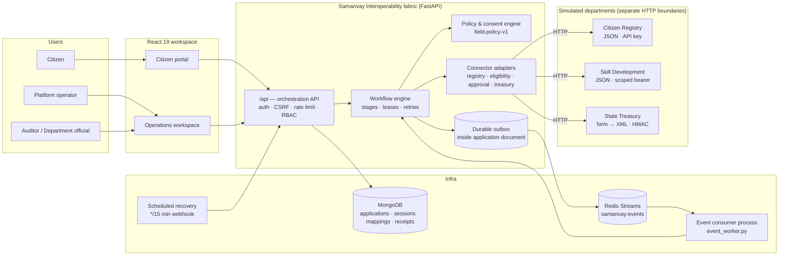
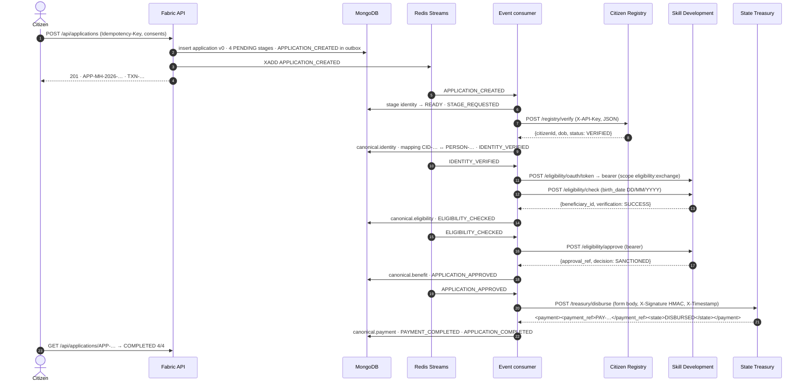
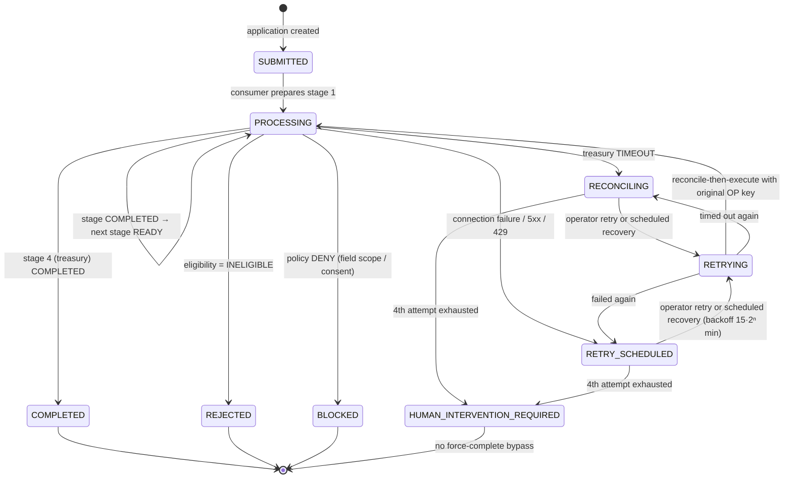
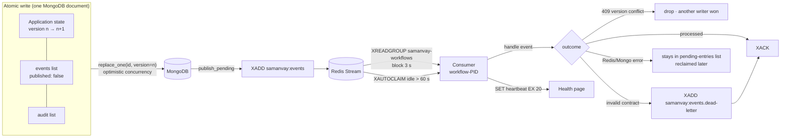
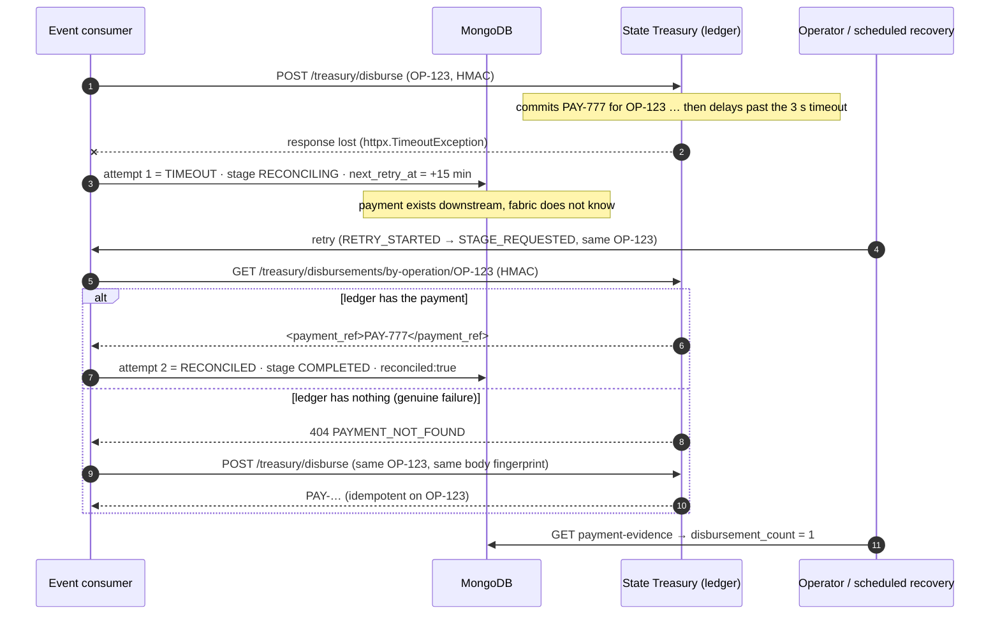
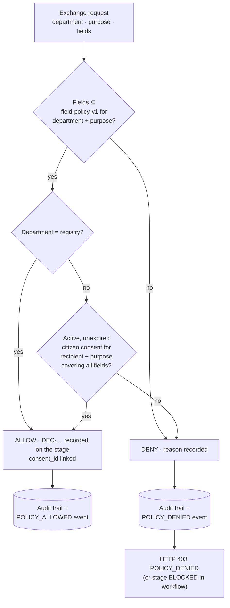

# Samanvay — Government Service Interoperability Fabric

**Smart India Hackathon problem statement SIH26129 — System integration among government digital platforms.**

Samanvay (Marathi/Sanskrit: *coordination*) is a prototype that lets one citizen application flow across
three independent government systems that were never designed to talk to each other — a Citizen Registry,
a Skill Development department and the State Treasury — while keeping every department authoritative for
its own data. It does not replace any government system; it makes them work together.

> **Simulation boundary (read this first).** The three departments, the identity provider, the citizens and
> the payments are **simulated** inside this repository. The HTTP calls between the orchestrator and the
> departments, the MongoDB persistence, the Redis Streams event transport, the authorization decisions and the
> audit trail are **real**. No claim of production readiness or exactly-once delivery is made.

---

## Table of contents

1. [What the prototype demonstrates](#1-what-the-prototype-demonstrates)
2. [Architecture](#2-architecture)
   - 2.1 [System context](#21-system-context)
   - 2.2 [Successful service journey](#22-successful-service-journey)
   - 2.3 [Workflow state machine](#23-workflow-state-machine)
   - 2.4 [Durable outbox and Redis Streams propagation](#24-durable-outbox-and-redis-streams-propagation)
   - 2.5 [Timeout-after-commit reconciliation](#25-timeout-after-commit-reconciliation)
   - 2.6 [Policy, consent and audited denial](#26-policy-consent-and-audited-denial)
3. [Interoperability model](#3-interoperability-model)
4. [Reliability model](#4-reliability-model)
5. [Security model](#5-security-model)
6. [Jury demo script (12 minutes)](#6-jury-demo-script-12-minutes)
7. [Run it yourself](#7-run-it-yourself)
8. [API reference](#8-api-reference)
9. [Repository layout](#9-repository-layout)
10. [Architecture decisions](#10-architecture-decisions)
11. [Known limitations and non-claims](#11-known-limitations-and-non-claims)

---

## 1. What the prototype demonstrates

| Capability | How it is shown |
| --- | --- |
| **Heterogeneous protocol integration** | Registry = REST/JSON + API key · Skill Development = REST/JSON + scoped OAuth-style bearer · Treasury = form-encoded request, **XML** response, **HMAC-SHA256** signature |
| **Schema transformation** | Every department response is normalised into one *Canonical v1* model; each stage stores the native payload, the canonical output and a field-level lineage table (`mapping_version`) |
| **Identifier correlation** | One `APP-MH-YYYY-…` application ID and one `TXN-…` transaction ID are correlated with every department's external reference (`CID-…`, `BEN-…`, `APR-…`, `PAY-…`) through an identifier-mapping projection |
| **Event-driven propagation** | A durable outbox in MongoDB is published to **Redis Streams**; a separate consumer process advances the workflow with at-least-once delivery, consumer groups, pending-entry reclaim and a dead-letter stream |
| **Failure recovery without double payment** | Two demo scenarios: *Treasury timeout after commit* (payment succeeded, response lost) and *Treasury unavailable* (HTTP 503). Recovery reconciles against the treasury ledger using the original operation key — **exactly one payment** is ever created |
| **Real authorization** | Field-level policy + citizen consent gate every exchange. A live "policy probe" makes the Skill Development service request a bank-account field it is not entitled to and receives a **real, audited HTTP 403** |
| **Unified citizen status** | The citizen sees one application with four department stages, plain-language status, consent receipts and notifications — with no internal evidence leaking |
| **Role-based views** | Citizen (own applications only), Platform operator, Department official (own department's evidence only), Auditor (read-only) |

---

## 2. Architecture

### 2.1 System context



**Key design point:** the orchestrator never sees department transport details. Adapters translate protocol,
authentication and schema at the edge; the workflow engine only ever handles the canonical model.

### 2.2 Successful service journey



Every stage carries its own `operation_id` (`OP-…`). Departments key their idempotency on it, which is
what makes safe retries possible later.

### 2.3 Workflow state machine



Per-stage states mirror the application: `PENDING → READY → RUNNING (45 s lease) → COMPLETED` or one of the
recovery states. Attempts are capped at **four**; completion can never be forced.

### 2.4 Durable outbox and Redis Streams propagation



* The event *intent* is written in the same document write as the state change, so a crash between "save"
  and "publish" loses nothing — `publish_pending()` republishes anything still `published:false` on
  worker start, on every recovery tick and on every API mutation.
* Delivery is **at-least-once**; handlers are idempotent through optimistic versioning and stage-state
  guards. This is stated honestly in the UI and in this document — no exactly-once claim.

### 2.5 Timeout-after-commit reconciliation

The hardest interoperability failure: the treasury *did* pay, but the response never arrived.



Reconciliation always runs **before** re-execution on any attempt ≥ 2, and the treasury enforces idempotency on
`operation_id` with a payload fingerprint (`409 IDEMPOTENCY_CONFLICT` if a retry ever changed the amount).
Result: one business payment, provable from the treasury's own ledger via the *payment evidence* endpoint.

### 2.6 Policy, consent and audited denial



* The decision is evaluated **inside the workflow** before every department call *and* on the service-to-service
  data-access endpoint (`POST /api/transactions/{txn}/data-access`, bearer-authenticated service principal).
* The **policy probe** in the operator UI makes the *real* Skill Development service token request
  `citizen.bankAccount` for `SKILL_BENEFIT_ELIGIBILITY`. The field is outside the purpose's allowed set, so the
  fabric records `POLICY_DENIED` durably **first**, then returns 403. If the audit write fails, access is denied
  (`503 AUDIT_UNAVAILABLE`) — never the other way round.
* Citizens can revoke a consent; revocation blocks *future* exchanges and is not retroactive (completed stages
  remain, with their receipts).
* Date of birth is **never retained** by the fabric: it is fetched transiently from the registry, transformed
  to the department's format, and discarded.

---

## 3. Interoperability model

### Connectors

| Department | Role in journey | Protocol | Auth | Native schema (`schema_version`) | Native → Canonical |
| --- | --- | --- | --- | --- | --- |
| **Citizen Registry** (Dept A) | Identity verification | REST / JSON | `X-API-Key` | `registry-v1`: `citizenId`, `dob`, `status` | `status` → `identity.verificationStatus` · `citizenId` → `identity.externalReference` · `dob` validated ISO, **transient** |
| **Skill Development** (Dept B) | Eligibility check + department approval | REST / JSON | Client-credentials token → scoped bearer (`eligibility:exchange`, 5 min) | `eligibility-v1`: `beneficiary_id`, `verification` · `approval-v1`: `approval_ref`, `decision` | `SUCCESS → ELIGIBLE`; ISO date → `DD/MM/YYYY` on the way **in**; `SANCTIONED → benefit.approvalReference` |
| **State Treasury** (Dept C) | Benefit disbursement | `application/x-www-form-urlencoded` request, **XML** response | HMAC-SHA256 over `timestamp.method.path.body`, ±60 s window | `treasury-v1`: `/payment/payment_ref`, `/payment/state` | safe XML extraction (defusedxml) · `DISBURSED → COMPLETED` |

### Canonical v1 model (what the orchestrator actually reasons about)

```
person.globalReference          identity.verificationStatus   identity.externalReference
eligibility.status              eligibility.beneficiaryReference
benefit.approvalReference       benefit.payeeReference        benefit.amount
payment.reference               payment.status
```

### Identifier correlation

| Identifier | Issued by | Example | Purpose |
| --- | --- | --- | --- |
| `APP-MH-2026-…` | Fabric | `APP-MH-2026-326E4B13C994` | Citizen-facing application ID |
| `TXN-…` | Fabric | `TXN-C6080D53F2BD` | Cross-department transaction ID, present in every event and department request |
| `OP-…` | Fabric, one per stage | `OP-7490CB7F664D` | Idempotency key each department stores; the reconciliation key |
| `PERSON-…` | Fabric | `PERSON-CITIZEN` | Global person reference, never a department's ID |
| `CID-…` / `BEN-…` / `APR-…` / `PAY-…` | Departments | `PAY-3F1A…` | External references, projected into `identifier_mappings` (`system`, `entity_type`, `external_id`, `internal_reference`) |

The transaction search on the **Transactions** page resolves an application ID, transaction ID or citizen name
to the unified transaction view, whose **Correlation** panel lists every external reference.

---

## 4. Reliability model

| Concern | Mechanism |
| --- | --- |
| Duplicate submissions | `Idempotency-Key` header (8–120 chars) per owner; a different payload under the same key → `409 IDEMPOTENCY_CONFLICT` |
| Concurrent writers (API + consumer) | Single application document with `version`; every write is `replace_one({id, version})`; mismatch → `409 VERSION_CONFLICT`, event handler exits and the stream redelivers |
| Stuck attempts | 45 s stage lease; expired leases are re-executed; consumer pending entries idle > 60 s are reclaimed with `XAUTOCLAIM` |
| Transient department failure | Retryable outcomes: `TIMEOUT`, `CONNECTION_FAILED`, `DOWNSTREAM_UNAVAILABLE` (5xx/429). Backoff `15 · 2^(attempt-1)` minutes. Non-retryable: `SCHEMA_ERROR`, 4xx |
| Retry ceiling | 4 attempts per stage → `HUMAN_INTERVENTION_REQUIRED`; no bypass |
| Double payment | Reconcile-before-execute on attempt ≥ 2; treasury idempotency on `operation_id` + body fingerprint |
| Lost publish | Outbox flags inside the document; republished on consumer start, on recovery ticks and after every mutation |
| Poison messages | Contract violations → `samanvay:events.dead-letter`, then ACK |
| Scheduled recovery | Platform cron `*/15 * * * *` → `POST /api/internal/maintenance/recover` (Bearer secret, idempotent `run_id` receipt, 202 then background) → republishes outbox and retries every due `RECONCILING`/`RETRY_SCHEDULED` application |
| Process supervision | `samanvay-redis` and `samanvay-events` run under supervisor with self-healing startup (Redis binary re-provisioned on pod resume; consumer waits for Redis instead of crashing) |
| Bounded growth | 180 events per transaction, 64 KB request/response bodies, 1 000-document monitoring scope |

---

## 5. Security model

| Layer | Implementation |
| --- | --- |
| Authentication | Simulated local identity adapter: bcrypt password hashes, HS256 JWT bound to a server-side session (`sid`) that can be revoked; 4 h expiry |
| Session transport | `samanvay_session` cookie: `Secure`, `HttpOnly`, `SameSite=Lax`, `Path=/api` |
| CSRF | Double-submit: `samanvay_csrf` cookie (readable) must be echoed in `X-CSRF-Token`; hash stored with the session |
| Origin control | Exact configured allow-list (`APP_ORIGIN`, `TRUSTED_ORIGINS`), no wildcards; Fetch-Metadata guard rejects `Sec-Fetch-Site: same-site/cross-site` login attempts even when a proxy rewrites `Origin` |
| Rate limiting | Redis counters: 30 login attempts / minute, 120 mutations / minute per identity; **fails closed** on login if Redis is down (`503 AUTH_UNAVAILABLE`) |
| Authorization | Roles: `citizen` (create, revoke, read own), `operator` (operate, inspect), `official` (inspect own department), `auditor` (inspect read-only), `service` (data access only). Citizens get `404`, not `403`, for other people's applications |
| Department credentials | Never in the orchestrator's domain code: API key, client secret and HMAC secret are read by adapters from `.env.local` (chmod 600, git-ignored) |
| Field-level policy | `field-policy-v1`: per department × purpose allow-list, default **DENY**, consent required for non-registry recipients |
| Data minimisation | Citizen projection strips events, audit, evidence, operation IDs and canonical data; officials see only their department's slices; DOB never persisted |
| Input hardening | Strict Pydantic models (`extra=forbid`), `Literal` enums, bounded lengths, defusedxml for XML, 64 KB body cap, `X-Content-Type-Options`, `Cache-Control: no-store`, `X-Request-ID` on every response |

---

## 6. Jury demo script (12 minutes)

**Before the jury arrives (2 min):**

1. Open the app URL in two browser windows (or one normal + one private window).
2. Sign in as **operator** (`operator@demo.in`) in window A and as **citizen** (`citizen@demo.in`) in window B.
   All demo passwords are `Demo@2026!`.
3. In window A go to **System health** and confirm Redis, MongoDB and the event consumer show *HEALTHY*
   with a recent heartbeat.

> Speak the boundary out loud at the start: *"The departments you will see are simulated inside this
> repository. Everything between them — the HTTP calls, the different protocols, the events, the database,
> the authorization — is real."*

| ⏱ | Step | Click | What to say / what the jury sees |
| --- | --- | --- | --- |
| 0:00 | **The problem** | Window A → **Overview** | "Three departments, three protocols, no shared ID. Today a citizen carries paper between them." Point at the *Connected public services* cards: JSON + API key, JSON + bearer, XML + HMAC. |
| 1:00 | **Citizen submits once** | Window B → **Start a service** → pick a course and district → tick both consent boxes → **Apply now** | Note the two consent receipts (eligibility, treasury) and the single `APP-MH-2026-…` ID. Copy the **TXN** ID. |
| 1:45 | **Watch it propagate** | Window B stays on the application page | Within ~10 s the four stages turn *Completed*: Identity → Eligibility → Approval → Disbursement. "Four departments, one status, no re-entry of data." Show **Notifications**. |
| 2:30 | **Same transaction, operator view** | Window A → **Transactions** → paste the TXN in *Search application, transaction or citizen…* → open it | Header shows APP ID ↔ TXN ID. In the **Service journey** tab select each stage: the *Schema transformation* panel shows the **Department response** next to the **Canonical model** with the lineage rows (`SUCCESS → ELIGIBLE`, `DD/MM/YYYY ↔ ISO · transient`, `/payment/state → DISBURSED → COMPLETED`). |
| 3:45 | **Identifier correlation** | Same page → right-hand **Correlation** panel (*One transaction. Every reference.*) | `CID-…`, `BEN-…`, `APR-…`, `PAY-…` all hang off the one TXN. Sidebar **Schema mappings** shows the pinned, inspectable contracts — no executable mapping expressions. |
| 4:30 | **Event stream** | **Event stream** tab | Sequence numbers, `causation_id` chain, Redis stream IDs on every published event. "This is a durable outbox published to Redis Streams and consumed by a separate process — at-least-once, honestly labelled." |
| 5:15 | **Failure: timeout after commit** | **New demo journey** → choose **Treasury timeout** → **Start journey** | Stages 1–3 complete; stage 4 goes **RECONCILING** with a recovery banner: *"Treasury outcome requires recovery"*. Explain: "The treasury paid, but the response was lost. The dangerous move is to pay again." |
| 6:30 | **Prove no double payment** | **Recover transaction** → type a recovery reason → confirm | Watch attempt 2 finish as **RECONCILED**: the adapter queried the treasury ledger by the original `OP-…` key and found the payment. The disbursement stage panel reads **1 disbursement in the treasury ledger** with the `PAY-…` reference. "One payment. Provable from the department's own ledger." |
| 7:45 | **Failure: department down** | **New demo journey** → **Treasury unavailable** → **Start journey** | Stage 4 gets a real HTTP 503 → **RETRY_SCHEDULED**, backoff shown. Click **Restore simulator**, then **Recover transaction** → completes with exactly one payment. Mention the `*/15 min` scheduled recovery does this automatically when nobody is watching. |
| 9:00 | **Real authorization** | On any transaction → **Run authorization check** | The Skill Development *service token* asks for `citizen.bankAccount`. Result: **HTTP 403 POLICY_DENIED** with a decision ID. Switch to the **Audit trail** tab: the `POLICY_DENIED` entry was recorded *before* the refusal was returned. Sidebar **Policy & consent** shows the allow-list with default DENY. |
| 10:15 | **Citizen control** | Window B → the application → **Consent** tab → **Revoke consent** on the treasury consent | Revocation is recorded; completed stages stay intact ("not retroactive"), any future treasury exchange for this application would be BLOCKED. |
| 11:00 | **Isolation & least privilege** | Sign out window B, sign in as `rohan@demo.in` → try to open Aditi's application URL | `Application not found` (404, not 403 — no existence leak). Optionally sign in as `official@demo.in`: only eligibility/approval evidence is visible. |
| 11:45 | **Close** | Window A → **System health** | Success rate, latency per connector, stream length, pending messages, consumer heartbeat. "Departments stay authoritative. Samanvay only coordinates — and proves it." |

**If something goes wrong on stage**

* A stage sits at *Submitted* or *Processing* for more than 30 s → **System health**: if Redis or the consumer
  is *UNAVAILABLE*, run `python /app/scripts/restore_runtime.py` in the terminal and wait 10 s. Nothing is lost;
  the outbox republishes.
* You clicked *Recover* too fast and got *"Wait for the current attempt to finish"* → the stage lease is
  still active; wait a few seconds and retry.
* Login shows *Sign-in protection is temporarily unavailable* → Redis is down (rate limiter fails closed) —
  same fix as above.

**Questions the jury usually asks**

* *Is this exactly-once?* No — at-least-once delivery with idempotent handlers and optimistic versioning; the
  business-level guarantee (one payment) comes from reconcile-before-execute plus treasury idempotency.
* *What if the treasury ledger itself is unreachable during reconciliation?* The attempt is recorded as
  `CONNECTION_FAILED`/`TIMEOUT`, stays recoverable, and the retry budget (4) prevents infinite loops; after that a
  human must investigate — there is deliberately no *force complete*.
* *Where does the real government API go?* Replace one adapter class in `backend/modules/connectors.py`; the
  workflow, policy, events and UI do not change. The connector registry and mapping tables are the contract.

---

## 7. Run it yourself

### Prerequisites

* Python 3.11, Node 18+ with **yarn**, MongoDB 6+, Redis 7+ (`redis-server` on `PATH`)

### Backend

```bash
cd backend
pip install -r requirements.txt

# First-time setup: generates all secrets into .env.local (chmod 600, git-ignored) and puts the
# scheduled-recovery credential in .env. Never prints secrets.
REDIS_URL=redis://127.0.0.1:6379/0 MOCK_BASE_URL=http://127.0.0.1:8001 python setup_local.py

# Three processes:
python run_redis.py &                         # supervised Redis with AOF in backend/runtime-data
python event_worker.py &                      # Redis Streams consumer (separate process, not a web timer)
uvicorn server:app --host 0.0.0.0 --port 8001 # API + simulated departments
```

`backend/.env` (protected): `MONGO_URL`, `DB_NAME`, `WEBHOOK_CRON_SECRET`.
`backend/.env.local` (generated): `JWT_SECRET`, `REGISTRY_KEY`, `ELIGIBILITY_SECRET`, `TREASURY_SECRET`,
`APP_ORIGIN`, `TRUSTED_ORIGINS`, `REDIS_URL`, `MOCK_BASE_URL`, `STREAM_NAME`, `STREAM_GROUP`,
`CONNECTOR_TIMEOUT` (3 s), `DEMO_MODE`, `DEMO_PASSWORD`.

On the hosted preview these three processes are supervised; `python scripts/restore_runtime.py` re-installs
Redis (if the pod image lost it), re-runs `setup_local.py`, installs the supervisor programs and starts them.

### Frontend

```bash
cd frontend
yarn install
yarn start        # uses REACT_APP_BACKEND_URL from frontend/.env
yarn build        # production build
```

### Demo accounts (seeded idempotently on startup — synthetic people, synthetic data)

| Email | Role | Notes |
| --- | --- | --- |
| `citizen@demo.in` | Citizen — Aditi Patil | Registry subject `DEMO-CITIZEN-001`, eligible (age 18–35) |
| `rohan@demo.in` | Citizen — Rohan Shah | Used to prove ownership isolation |
| `operator@demo.in` | Platform operator | Demo journeys, recovery, policy probe |
| `official@demo.in` | Skill Development official | Sees only eligibility/approval evidence |
| `auditor@demo.in` | Auditor | Read-only inspection |

Password for all: `Demo@2026!` (configurable via `DEMO_PASSWORD`).

### Tests

```bash
# Backend contract, journey, recovery, authorization and resilience suites (run against a live stack)
pytest tests/backend_test.py                   # 74 checks: journeys, reconciliation, RBAC, idempotency, events
pytest tests/test_fetch_metadata_auth.py       # 17 checks: origin / Fetch-Metadata / CSRF / cookies
pytest tests/test_iteration5_resilience.py     # 14 checks: Redis outage, worker restart, cron dispatcher
```

Scheduled recovery can be exercised without waiting for the cron by running the platform dispatcher:

```bash
API=$(grep REACT_APP_BACKEND_URL frontend/.env | cut -d= -f2)
CRON_NAME=workflow-recovery METHOD=POST \
ENDPOINT_URL_B64=$(printf '%s' "$API/api/internal/maintenance/recover" | base64 -w0) \
/bin/sh .emergent/cron/dispatch_webhook.sh          # → dispatch complete (… http=202)
```

---

## 8. API reference

All routes are under `/api`. Mutations require the `samanvay_csrf` cookie echoed in `X-CSRF-Token` and a
trusted `Origin`. Interactive docs: `/api/docs`.

| Method & path | Role | Purpose |
| --- | --- | --- |
| `POST /auth/login` · `POST /auth/logout` · `GET /auth/me` | any | Session lifecycle (cookie-based) |
| `GET /services` | any | Service catalogue (`MH_SKILL_BENEFIT`, ₹15 000) |
| `POST /applications` (`Idempotency-Key`) | citizen | Submit application with consents |
| `GET /applications` · `GET /applications/{id\|txn}` | all (scoped) | List / unified status; citizens see own only |
| `GET /transactions/{key}` | operator, auditor, official | Full evidence view |
| `POST /transactions/{key}/stages/{stage}/retry` (`Idempotency-Key`, `version`) | operator | Recover a `RECONCILING` / `RETRY_SCHEDULED` / `HUMAN_INTERVENTION_REQUIRED` stage |
| `GET /transactions/{key}/payment-evidence` | operator | Treasury ledger count for the disbursement operation |
| `POST /applications/{key}/consents/{id}/revoke` | citizen | Revoke a consent (non-retroactive) |
| `POST /transactions/{key}/data-access` | service (bearer) | Policy-gated field exchange; audited ALLOW/DENY |
| `POST /demo/journeys` · `POST /demo/transactions/{key}/scenario` · `POST /demo/transactions/{key}/policy-probe` | operator (`DEMO_MODE`) | Scenario controls: `success`, `timeout_after_commit`, `treasury_unavailable`; live 403 probe |
| `GET /connectors` · `GET /mappings` · `GET /policies` · `GET /audit` · `GET /monitoring/overview` | inspect roles | Registry of contracts, mappings, policy rules, audit trail, health |
| `GET /notifications` · `PATCH /notifications/{id}` | any (scoped) | Citizen/operator notifications |
| `POST /internal/maintenance/recover` | cron (Bearer `WEBHOOK_CRON_SECRET`) | Scheduled recovery; idempotent on `run_id`; 202 then background |
| `POST /mock/registry/verify` · `/mock/eligibility/oauth/token` · `/mock/eligibility/check` · `/mock/eligibility/approve` · `/mock/treasury/disburse` · `GET /mock/treasury/disbursements/by-operation/{op}` | department credentials | **Simulated** department boundaries (disabled when `DEMO_MODE=false`) |

Error envelope: `{"error": {"code", "message", "details", "requestId", "retryable"}}`.

---

## 9. Repository layout

```
backend/
  server.py                 FastAPI app: CORS, rate limiting, security headers, error envelope
  event_worker.py           Redis Streams consumer (separate process)
  run_redis.py              Self-healing supervised Redis launcher
  setup_local.py            Idempotent secret/config bootstrap (never prints secrets)
  core/                     config (env + trusted origins), database (Mongo/Redis clients, indexes), errors
  modules/
    auth.py                 Login, JWT+session, CSRF, Fetch-Metadata/Origin guards, principal
    router.py               Orchestration API (applications, transactions, recovery, demo, policy, monitoring)
    workflow.py             Stage engine: leases, attempts, reconcile-before-execute, canonical merge, mappings
    recovery.py             Operator retry + scheduled maintenance
    events.py               Consumer group bootstrap + outbox publisher
    repository.py           Atomic document write, event/audit emit, projections per role
    policy.py               field-policy-v1, consent evaluation, RBAC, visibility
    connectors.py           Registry / Eligibility / Approval / Treasury adapters (JSON, bearer, form+XML+HMAC)
    definitions.py          Pinned stage, connector and mapping contracts (inspectable, non-executable)
    models.py · seed.py     Strict Pydantic models · idempotent demo seed
  mock_departments/router.py  Simulated departments with their own auth, idempotency and failure scenarios
frontend/src/
  pages/                    Login, Overview, Applications, Transaction, Audit, Resources, NewApplication, Notifications
  components/transactions/  StageInspector (native vs canonical), EvidenceTabs, DemoDialog, ApplicationTable
  components/layout/AppShell.tsx  Role-aware navigation
  government-theme.css      Navy / white / green / saffron theme
scripts/
  restore_runtime.py · samanvay-supervisor.conf   Runtime restoration for the hosted preview
tests/                      backend_test.py · test_fetch_metadata_auth.py · test_iteration5_resilience.py
.emergent/crons.yml         Scheduled recovery definition (*/15 min)
```

---

## 10. Architecture decisions

| # | Decision | Why |
| --- | --- | --- |
| 1 | **Orchestration fabric, not a data lake** | Departments stay authoritative; the fabric stores canonical *references and evidence*, not copies of citizen records (DOB is transient). This matches the mandate to integrate, not replace. |
| 2 | **One document per transaction as the durability boundary** | State, outbox events and audit change together in one `replace_one` guarded by `version`. No distributed transaction, no lost event. |
| 3 | **Redis Streams with consumer groups** over a simple pub/sub or in-process timers | Durable, replayable, supports pending-entry reclaim and dead-lettering; the consumer is a *separate process* so the web tier can restart without losing work. |
| 4 | **Reconcile-before-execute** on every retry | The only safe answer to "did the payment happen?" is to ask the ledger by the original operation key before acting. |
| 5 | **Pinned, declarative mapping tables** (no executable mapping DSL) | Contracts are inspectable by auditors and juries; each stage stores `mapping_version` so evidence is reproducible. |
| 6 | **Default-deny field policy + consent, evaluated at both workflow and API edges** | Authorization must be real, not a UI label; the probe produces a genuine, audited 403. |
| 7 | **Fail-closed security dependencies** | If the rate limiter or audit store is unavailable, login/data-access is refused rather than silently unprotected. |
| 8 | **Retry budget with no force-complete** | Bounded automation, explicit human escalation — appropriate for public money. |
| 9 | **Simulated departments in-repo but behind real HTTP, with distinct protocols and credentials** | Lets the jury see the integration problem honestly without pretending to have government access. |

---

## 11. Known limitations and non-claims

* Departments, identity, citizens and payments are simulated; no live government endpoint is called.
* Event delivery is at-least-once; the exactly-once *business* outcome relies on downstream idempotency.
* Identifier mappings are embedded in the transaction document and projected; a standalone mapping service is
  future work.
* Retry budget is fixed at four attempts; backoff is 15 · 2ⁿ minutes; scheduled recovery runs every 15 minutes.
* Login fails closed while Redis is unavailable (by design); the hosted preview self-heals Redis on resume.
* Legacy clients without Fetch-Metadata headers behind an Origin-rewriting proxy rely solely on the exact
  origin allow-list.
* This is a hackathon prototype for SIH26129 and is not production software.
